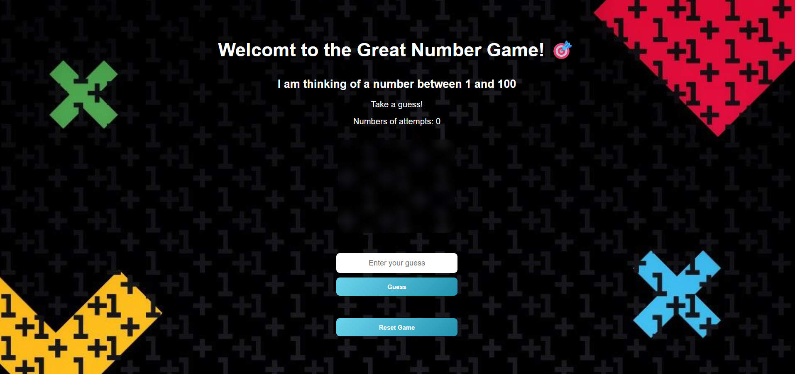
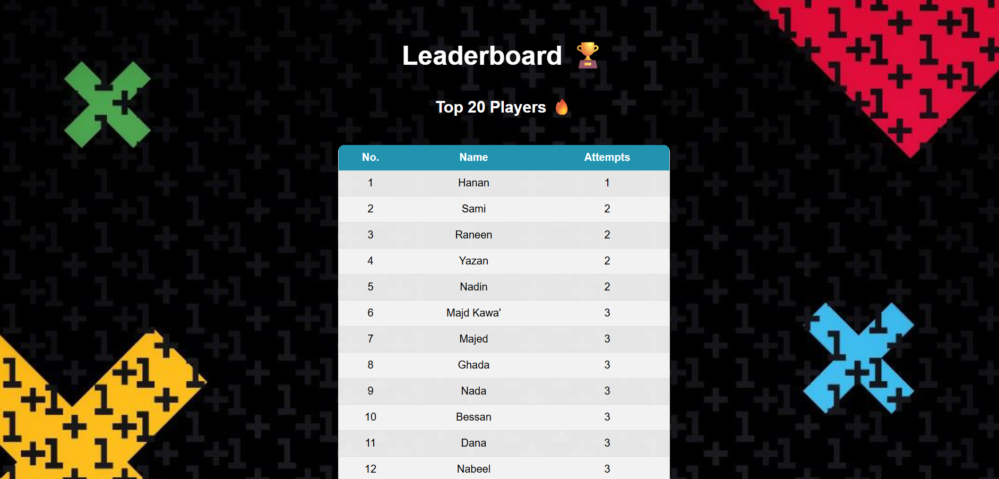
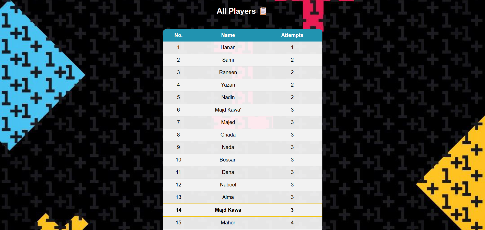

# Great Number Game
### 📖 Project Overview
A simple and fun number guessing game where the player tries to guess a randomly generated number (from 1 to 100) within 5 attempts. The game provides hints after each guess, helping the player get closer to the correct answer.

---

## ✨ Features
- 🎲 Random number generation from **1 - 100**
- 🔢 Maximum of **5 attempts**
- 📢 Hint system (Too High / Too Low)
- 🏆 Top 20 Leaderboard
- 📋 Winners Table
- 🎮 Simple and interactive gameplay
- 💻 Beginner-friendly project structure

---

## 📸 Screenshots
### Main Game Home Interface


### Leaderboard Table


### Winning Players Table


---

## 🛠️ Tech Stack
- **Frontend:** HTML, CSS
- **Backend:** Python (Django)
- **Database:** MySQL

---

## ⚙️ Installation & Setup
### 1. Clone repo
```bash
git clone https://github.com/Majd-Kawa/Great-Number-Game.git 
cd ninja_gold
```

### 2. Create virtual environment
```bash
python -m venv env
```

### 3. Activate virtual environment

**Windows**
```bash
call env\Scripts\activate
```

**Mac/Linux**
```bash
source env/bin/activate
```

### 4. Install dependencies
```bash
pip install -r requirements.txt
```

### 5. Run database migrations:
python manage.py makemigrations
python manage.py migrate

### 6. Start server
```bash
python manage.py runserver
```

### 7. Visit in browser
```
http://127.0.0.1:8000
```

---

## 🕹️ How to Play
1. Start the game
2. Enter a number between **1 and 100**
3. You have **5 attempts** to guess correctly
4. The game gives hints after each guess **(Too High / Too Low / Correct)**
5. Keep guessing until you find the secret number or run out of attempts.

---

## 📌 Future Improvements
-	Difficulty levels
-	Timer challenges
-	Replay option for endless fun 


